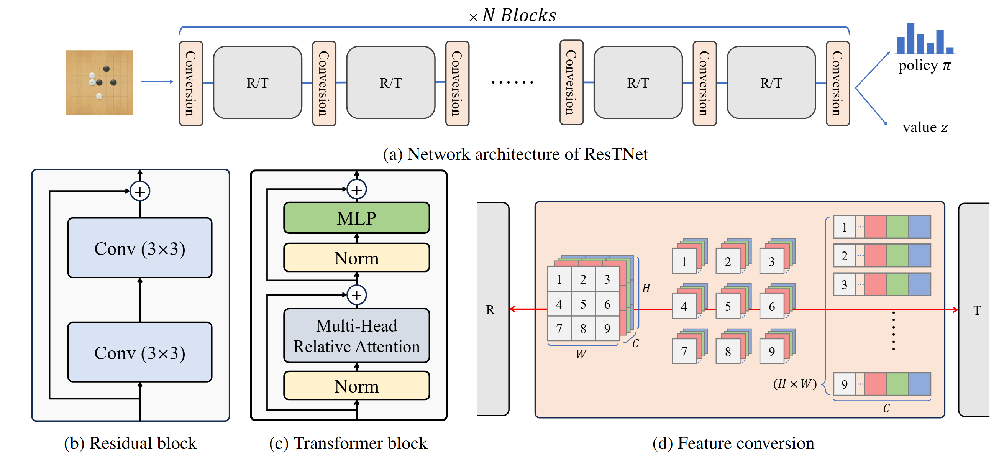

# Bridging Local and Global Knowledge via Transformer in Board Games

This is the official repository of the IJCAI 2025 paper [Bridging Local and Global Knowledge via Transformer in Board Games](https://rlg.iis.sinica.edu.tw/papers/restnet).

If you use this work for research, please consider citing our paper as follows:
```
@inproceedings{ju2025bridging,
  title={Bridging Local and Global Knowledge via Transformer in Board Games},
  author={Ju, Yan-Ru and Wu, Tai-Lin and Shih, Chung-Chin and Wu, Ti-Rong},
  booktitle={IJCAI},
  year={2025}
}
```



This repository is built upon [MiniZero](https://github.com/rlglab/minizero). The followings provide the instructions to reproduce the main experiments in the paper.

## Train ResTNet
This section provides the instructions for training ResTNet.

### Prerequisites
The ResTNet program requires a Linux platform with at least one NVIDIA GPU to operate.

#### 1. Clone This Repository
Run the following command to clone the repository:

```bash
git clone --recursive https://github.com/rlglab/restnet.git
```

#### 2. Train the Model
```
tools/quick-run.sh train [Game Type] [End Iteration] -conf_file [Configuration File] -conf_str [Configuration String]
```
* [Game Type]: The name of the game (e.g., go, hex, othello).
* [End Iteration]: The total number of iterations for training (e.g., 500)
* [Configuration File]: Path to the model configuration file. We have provided the configuration files used in the paper:
    - `configs/9x9_go/*.cfg` for 9x9 Go
    - `configs/19x19_go/*.cfg` for 19x19 Go
    - `configs/19x19_hex/*.cfg` for 19x19 Hex
* [Configuration String]: Additional configurations based on the configuration file, e.g., `nn_blocks_type=RRTRRT`.

The following lists some example commands for reproducing experiments in each section:
```bash
# Section 4.1: Training ResTNet in 9x9 Go, 19x19 Go, and 19x19 Hex
# Train 9x9 Go with RRTRRT for 500 iterations
tools/quick-run.sh train go 500 -conf_file configs/9x9_go/RRTRRT.cfg
# Train 19x19 Hex with 10R for 500 iterations
tools/quick-run.sh train hex 500 -conf_file configs/19x19_hex/10R.cfg
```

<details><summary>You can adjust configuration files to support training different architectures.</summary>

```bash
nn_embed_kernel_size=3     # 1 or 3, setting kernel window size used in the embedding convolution. 1 is positional embedding
nn_blocks_type=R_R_T_R_R_T # each block in restnet is split by '_', block type: R, T, e.g.: R_T is 1R1T; T_R is 1T1R
nn_policy_type=P           # P (AlphaZero Policy) / TP (Transformer Policy)
nn_value_type=TV           # V (AlphaZero Value) / TV (Transformer Value)
nn_bv_flag=false           # false, use board evaluation head or not
```

</details>

## Training Results

After training starts, a folder will be created:
```bash
# Format of folder name:
# "go": game name
# "gaz": muzero algorithm
# "2R1T2R1T": network architecture
# "n64": number of simulations used in MCTS
# "[GIT_SHORT_HASH]": git commit hash
go_9x9_gaz_2R1T2R1T_P_TV_n64-[GIT_SHORT_HASH]
├── Training.log                                                          # the main training log
├── Worker.log                                                            # the worker connection log
├── analysis                                                              # figures of the training process
│   ├── go_9x9_gaz_2R1T2R1T_P_TV_n64-[GIT_SHORT_HASH]_Lengths.png         # self-play game lengths
│   ├── go_9x9_gaz_2R1T2R1T_P_TV_n64-[GIT_SHORT_HASH]_Returns.png         # self-play game returns
│   ├── go_9x9_gaz_2R1T2R1T_P_TV_n64-[GIT_SHORT_HASH]_Time.png            # elapsed training time
│   ├── go_9x9_gaz_2R1T2R1T_P_TV_n64-[GIT_SHORT_HASH]_accuracy_policy.png # accuracy for policy network
│   ├── go_9x9_gaz_2R1T2R1T_P_TV_n64-[GIT_SHORT_HASH]_loss_policy.png     # loss for policy network
│   └── go_9x9_gaz_2R1T2R1T_P_TV_n64-[GIT_SHORT_HASH]_loss_value.png      # loss for value network
├── go_9x9_gaz_2R1T2R1T_P_TV_n64-[GIT_SHORT_HASH].cfg                     # configuration file
├── model                                                                 # all network models produced by each optimization step
│   ├── *.pkl                                                             # include training step, parameters, optimizer, scheduler
│   └── *.pt                                                              # model parameters only (use for testing)
├── op.log                                                                # the optimization worker log
└── sgf                                                                   # self-play games of each iteration
    └── *.sgf                                                             # `1.sgf`, `2.sgf`, ... for the 1st, the 2nd, ... iteration, respectively
```

## Experiments

This section decsribe how to reproduce each experiment in the main paper, including
- [Playing Performance](#playing-performance)
- [Defending Against the Cyclic-Adversary](#defending-against-the-cyclic-adversary)
- [Recognize Circular Patterns](#recognize-circular-patterns)
- [Recognize Ladder Patterns](#recognize-ladder-patterns)
- [Visualization of ResTNet](#visualization-of-restnet)

> [!NOTE]
> All experiment should be run in the container. Please [build programs](#build-programs) and [download trained models](#download-trained-models) first.

### Build Programs
Enter the container and build the required executables:
```bash
# Start the container
./scripts/start-container.sh

# Run the below commands to build programs inside the container
./scripts/build.sh go  # for Go
./scripts/build.sh hex # for Hex
```

### Download Trained Models
To use the trained models in the main paper, download the folder from this [link](https://rlg.iis.sinica.edu.tw/papers/restnet/assets/restnet-models.tar.gz) and place it in the repo.
```
restnet
├── CMakeLists.txt
├── README.md
├── assets
├── build
├── configs
├── experiments-datasets
├── gogui-turtorial.md
├── minizero
├── tools
├── restnet
|── scripts
└── restnet-models <-- place it here
```

### Playing Performance
To reprodce the experiment of playing performance of ResTNet in the Subsection 4.1, use the following commands: 
```
./scripts/playing-performance-go.sh [Game Type] [Board Size] [Model File] [Configuration File] [KataGo Execution Command] [GPU List] [Num Games] [Save Folder]
```
* [Game Type]: The name of the game (e.g., go, hex, othello).
* [Board Size]: Board size (e.g., 19).
* [Model File]: Path to the model .pt file.
* [Configuration File]: Path to the model configuration file.
* [KataGo Execution Command]: The command to run the adversary.
    - Download the adversary model from [lightvector/KataGo](https://github.com/lightvector/KataGo) and follow their setup instructions.
    - You can download specific version of KataGo models at https://katagotraining.org/networks/.
* [Color]: ResTNet's color (black or white).
* [GPU List]: List of GPU indices to use (e.g., 0, 0,1).
* [Num Games]: Number of games to be played.
* [Save Folder]: Directory to save the results.

We have provided some examples as follows. You can adjust the commands manually for running different settings.

#### 10R fights against KataGo model (b10c128-s5699):

```bash
# katago repo is placed at './katago'.
# We use kata1-b10c128-s56992512-d31122236 as an example and place it under katago/cpp/model/b10c128-s5699/.
katago_command="./katago/cpp/katago gtp -model katago/cpp/model/b10c128-s5699/kata1-b10c128-s56992512-d31122236.txt.gz -config configs/katago/n500.cfg"
restnet_model="restnet-models/10B-go-19-models/10R/model/weight_iter_150000.pt"
restnet_cfg="restnet-models/10B-go-19-models/10R/eval.cfg"
output_dir="experiments-results/10R_vs_katago_b10c128"
mkdir -p ${output_dir}
# This commands will fight 100 games on GPU:0.
./scripts/playing-performance-go.sh go 19 "${restnet_model}" "${restnet_cfg}" "${katago_command}" 0 100 "${output_dir}"
```

It will generate a directory `./experiments-results/10R_vs_katago_b10c128` which contains:
- `fight.dat`: A summary log file for all fights.
    <details><summary>Example of a .dat file:</summary>

    ```
    # Black: minizero
    # BlackCommand: /workspace/build/go/restnet_go -conf_file restnet-models/10B-go-19-models/10R/eval.cfg -conf_str "nn_file_name=restnet-models/10B-go-19-models/10R/model/weight_iter_150000.pt"
    # BlackLabel: minizero
    # BlackVersion: 1.0
    # Date: July 17, 2025 at 2:42:44 PM CST
    # Host: RLG02 (Intel(R) Xeon(R) Silver 4216 CPU @ 2.10GHz)
    # Komi: 7
    # Referee: -
    # Size: 19
    # White: KataGo
    # WhiteCommand: ./katago/cpp/katago gtp -model katago/cpp/model/b10c128-s5699/kata1-b10c128-s56992512-d31122236.txt.gz -config configs/katago/n500.cfg
    # WhiteLabel: KataGo
    # WhiteVersion: 1.14.1
    # Xml: 0
    #
    #GAME	RES_B	RES_W	RES_R	ALT	DUP	LEN	TIME_B	TIME_W	CPU_B	CPU_W	ERR	ERR_MSG
    0	B+R	B+R	B+R	0	-	271	477.1	8.8	0	8.6	0	
    1	B+R	B+R	B+R	1	-	174	308.6	5.3	0	5.2	0	
    2	B+R	B+R	B+R	0	-	299	532.2	10	0	9.9	0	
    3	B+R	B+R	B+R	1	-	278	493.3	9.4	0	9.3	0	
    4	B+R	B+R	B+R	0	-	217	383.7	7.4	0	7.3	0	
    5	B+R	B+R	B+R	1	-	188	329.2	6.2	0	6	0	
    6	W+R	W+R	W+R	0	-	76	137.4	2.4	0	2.4	0	
    7	W+R	W+R	W+R	1	-	395	705.3	12.1	0	11.9	0	
    8	B+R	B+R	B+R	0	-	253	445.2	7.9	0	7.8	0	
    9	W+R	W+R	W+R	1	-	541	947	16	0	15.7	0	
    10	B+R	B+R	B+R	0	-	259	456.5	8.5	0	8.3	0	
    11	B+R	B+R	B+R	1	-	210	370.3	6.3	0	6.2	0	
    12	W+R	W+R	W+R	0	-	338	604.1	11	0	10.8	0	
    13	B+R	B+R	B+R	1	-	212	373.8	6	0	5.9	0	
    14	W+R	W+R	W+R	0	-	314	551.6	10.3	0	10.2	0	
    15	B+R	B+R	B+R	1	-	188	331.4	5.8	0	5.7	0	
    16	B+R	B+R	B+R	0	-	169	298.4	5.2	0	5.1	0
    ...

    ```

    </details>

- `fight-[id].sgf`: SGF file of a fight.

#### R3(RRT) fights against KataGo model (b10c128-s5699):

```bash
# katago repo is placed at './katago'.
# We use kata1-b10c128-s56992512-d31122236 as an example and place it under katago/cpp/model/b10c128-s5699/.
katago_command="./katago/cpp/katago gtp -model katago/cpp/model/b10c128-s5699/kata1-b10c128-s56992512-d31122236.txt.gz -config configs/katago/n500.cfg"
restnet_model="restnet-models/10B-go-19-models/R3RRT/model/weight_iter_150000.pt"
restnet_cfg="restnet-models/10B-go-19-models/R3RRT/eval.cfg"
output_dir="experiments-results/R3RRT_vs_katago_b10c128"
mkdir -p ${output_dir}
# This commands will fight 100 games on GPU:0.
./scripts/playing-performance-go.sh go 19 "${restnet_model}" "${restnet_cfg}" "${katago_command}" 0 100 "${output_dir}"
```

It will generate a directory `./experiments-results/R3RRT_vs_katago_b10c128`

### Defending Against the Cyclic-Adversary
To reprodce the experiment of defending against the cyclic-adversary in the Subsection 4.2, use the following commands: 
```
./scripts/defending-cyclic-adversary-go.sh [Game Type] [Board Size] [Model File] [Configuration File] [Cyclic-Adversary Execution Command] [Opening Directory Path] [Color] [GPU List] [Num Games] [Save Folder]
```
* [Opening Directory Path]: Path to the directory containing predefined openings.
    - We provide 24 openings used in the main paper under: `./experiments-datasets/opening_data_final/`.
    - Use the `black/` or `white/` subdirectory depending on which color ResTNet plays.
* [Cyclic-Adversary Execution Command]: The command to run the adversarial agent. Download the adversary model from [AlignmentResearch/go_attack](https://github.com/AlignmentResearch/go_attack) and follow their setup instructions.

We have provided some examples as follows. You can adjust the commands manually for running different settings.

#### 10R vs. Cyclic-Adversary:

```bash
# 10R plays as Black, using 1 GPU, for 30 games.
# if the set up of go-attack is correct, you can run the attack_command alone.
attacker_command="go_attack/engines/KataGo-custom/cpp/katago gtp -model go_attack/sabaki/models/adv/cyclic-adv-s545065216-d136760487.bin.gz -victim-model go_attack/sabaki/models/victims/kata1-b40c256-s11840935168-d2898845681.bin.gz -config go_attack/configs/sabaki/gtp-adv600-vm1-s0508.cfg"

restnet_model="restnet-models/10B-go-19-models/10R/model/weight_iter_150000.pt"
restnet_cfg="restnet-models/10B-go-19-models/10R/eval.cfg"
# Here, we use 4.sgf as the opening.
opening_dir="experiments-datasets/opening_data_final/black/4"
color="black"
output_dir="experiments-results/10R_vs_cyclic-adv"

./scripts/defending-cyclic-adversary-go.sh go 19 "${restnet_model}" "${restnet_cfg}" "${attacker_command}" "${opening_dir}" "${color}" 0 30 "${output_dir}"
```

After running, results will be saved to: `experiments-results/10R_vs_cyclic-adv`.

#### R3(RRT) vs. Cyclic-Adversary:

```bash
# R3(RRT) plays as White, using 1 GPU, for 30 games.
attacker_command="go_attack/engines/KataGo-custom/cpp/katago gtp -model go_attack/sabaki/models/adv/cyclic-adv-s545065216-d136760487.bin.gz -victim-model go_attack/sabaki/models/victims/kata1-b40c256-s11840935168-d2898845681.bin.gz -config go_attack/configs/sabaki/gtp-adv600-vm1-s0508.cfg"

restnet_model="restnet-models/10B-go-19-models/R3RRT/model/weight_iter_150000.pt"
restnet_cfg="restnet-models/10B-go-19-models/R3RRT/eval.cfg"
# Here, we use 1.sgf as the opening.
opening_dir="experiments-datasets/opening_data_final/white/1"
color="black"
output_dir="experiments-results/R3RRT_vs_cyclic-adv"

./scripts/defending-cyclic-adversary-go.sh go 19 "${restnet_model}" "${restnet_cfg}" "${attacker_command}" "${opening_dir}" "${color}" 0 30 "${output_dir}"
```

After running, results will be saved to: `experiments-results/R3RRT_vs_cyclic-adv`.

### Recognize Circular Patterns
To reprodce the experiment of recognizing circular patterns in the Subsection 4.2, use the following commands:
```bash
# This command evaluates board ownership predictions on the 24-game dataset located at `./experiments-datasets/go_19x19_24_circular_patterns`
./scripts/recognize-circular-patterns.sh
```

After execute the above command, it will output the following:
```
sgf name        | 10R        | R3RRT
----------------+------------+-----------
1.sgf           | 2.74390    | 1.93498
2.sgf           | 1.09311    | 1.59597
3.sgf           | 2.78984    | 1.13934
4.sgf           | 3.75008    | 0.75763
5.sgf           | 3.86128    | 1.62526
6.sgf           | 3.76483    | 3.18770
7.sgf           | 3.00703    | 1.00186
8.sgf           | 1.39570    | 1.20132
9.sgf           | 2.04595    | 0.97428
10.sgf          | 3.86360    | 2.29973
11.sgf          | 3.81555    | 0.59234
12.sgf          | 2.49629    | 0.05020
13.sgf          | 3.78553    | 0.08365
14.sgf          | 3.79540    | 2.22892
15.sgf          | 0.00372    | 0.05154
16.sgf          | 0.00220    | 0.00746
17.sgf          | 1.09595    | 0.55454
18.sgf          | 2.98295    | 1.55024
19.sgf          | 3.62851    | 2.38296
20.sgf          | 3.66686    | 0.26868
21.sgf          | 3.79075    | 0.70525
22.sgf          | 3.66649    | 0.48440
23.sgf          | 0.08700    | 0.00242
24.sgf          | 0.00111    | 0.11154
----------------+------------+-----------
average         | 2.54723    | 1.03301

Table: The MSE of board evaluation in 24 games from cyclic-adversary.
```


### Recognize Ladder Patterns
To reprodce the experiment of recognizing ladder patterns in the Subsection 4.2, use the following commands:
```bash
./scripts/recognize-ladder-patterns.sh
```
> [!NOTE]
> This script evaluates R3(RRT) and 10R models on the dataset located at `./experiments-datasets/small_test_ladder_data.sgf`
> This dataset contains only 100 ladder samples. If you wish to evaluate on a different dataset, you can modify the bash script accordingly.

After running the script, a log file will be generated at `./experiments-results/ladder_eval.log`.
The output:
```
Ladder Evaluation Results:
Total Samples: 100
Threshold: < -0.5 or > 0.5

Average Accuracy:
R3RRT: 0.86000
10R: 0.45000
```


### Visualization of ResTNet
To reprodce the experiment of recognizing ladder patterns in the Subsection 4.2, use the following commands:

The usage of analysis command:

```bash
./analysis.sh [Game Type] [Model File] [Configuration File] [SGF File]
```

* [Game Type]: The name of the game (e.g., go, hex, othello).
* [Model File]: Path to the model .pkl file.
* [Configuration File]: Path to the model configuration file.
* [SGF File]: Path to the sgf file.

```bash
# Attention Maps in 19x19 Go
./scripts/analysis.sh go ./restnet-models/10B-go-19-models/R3RRT/model/weight_iter_150000.pkl ./restnet-models/10B-go-19-models/R3RRT/eval.cfg experiments-datasets/go_19x19_24_circular_patterns/23.sgf

# Attention Maps in 19x19 Hex
./scripts/analysis.sh hex ./restnet-models/10B-hex-19-models/R3RRT/weight_iter_100000.pkl ./restnet-models/10B-hex-19-models/R3RRT/R3RRT.cfg experiments-datasets/hex.sgf
```

After running the script, you can use following commands:
- `showboard`: Display the current board state.
- `bv`: Show board evaluation values for each position in the current state.
- `a [l] [h] [pos]`: Display the attention map at position `[pos]`, given transformer block ID `[l]` and head ID `[h]`. Returns attention color codes for all board positions.
    ```
    # the 1st T block with 1st head at pos E3
    a 0 0 E3
    ```

> [!NOTE]
> if you want to visulize as paper, following [ResTNet Visualization in GOGUI](docs/restnet-visualization-in-GOGUI.md).


