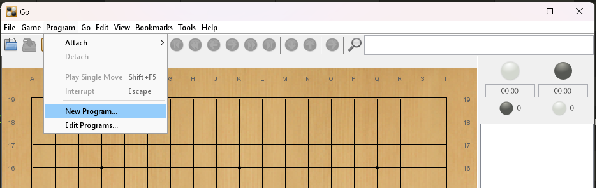
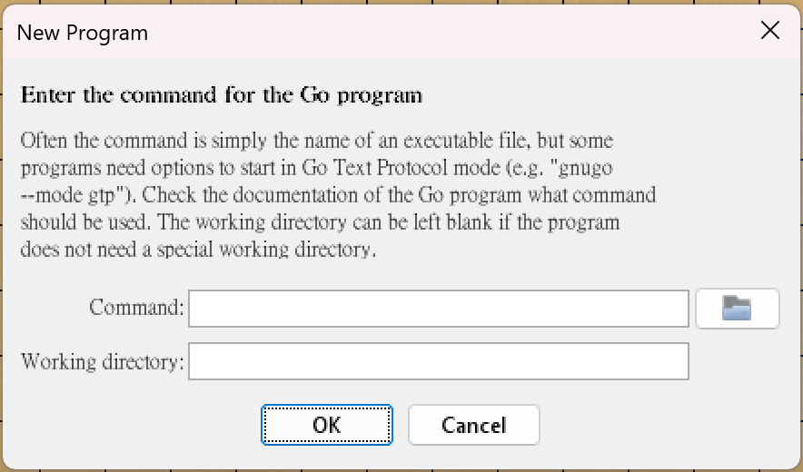
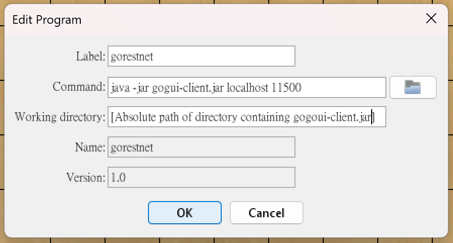
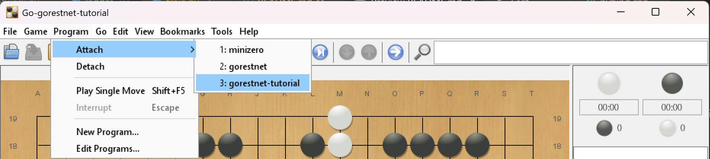
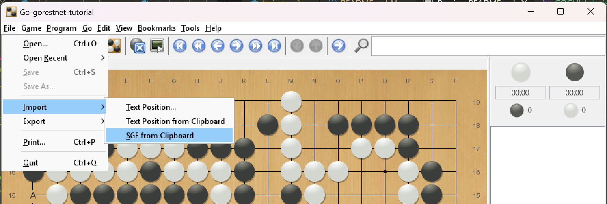
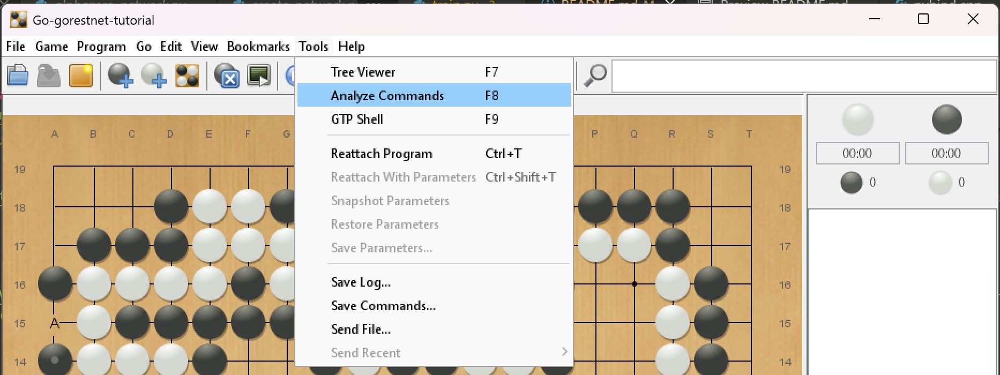
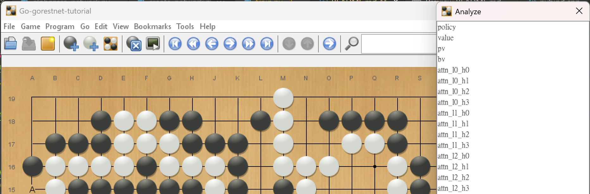
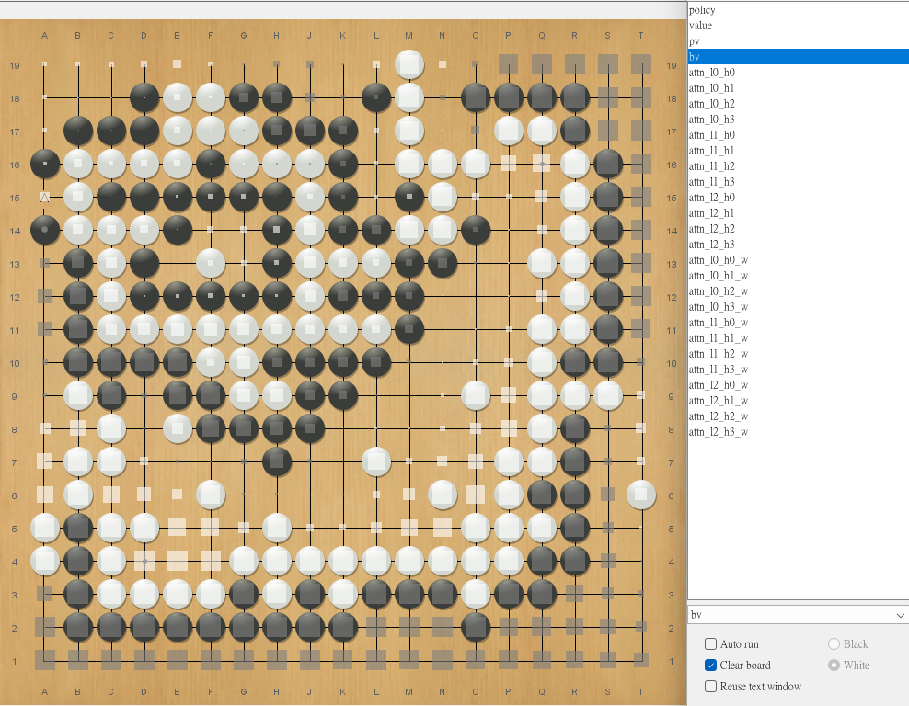
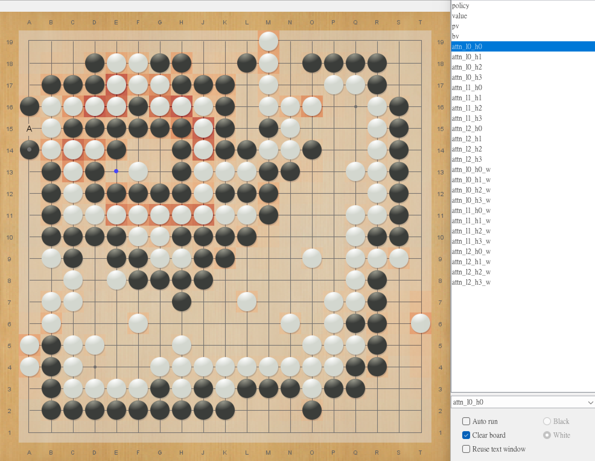

# Visualize Attention Maps with GoGUI

To visualize attention maps of Go games in our paper, we use [GoGUI](https://github.com/Remi-Coulom/gogui), an open-source GUI for Go analysis. Follow the steps below to set up and visualize games with your own analysis server.

#### 1. Start the Analysis Server (Inside Docker Container or Local Setup)

Run the gogui-server command with a specific port and analysis command with `gogui-server -port [PORT] "[ANALYSIS COMMAND]"`. For example:

```bash
# Attention Maps in 19x19 Go
gogui-server -port 11500 "./scripts/analysis.sh go ./restnet-models/10B-go-19-models/R3RRT/model/weight_iter_150000.pkl ./restnet-models/10B-go-19-models/R3RRT/eval.cfg"

# Attention Maps in 19x19 Hex
gogui-server -port 11500 "./scripts/analysis.sh hex ./restnet-models/10B-hex-19-models/R3RRT/weight_iter_100000.pkl ./restnet-models/10B-hex-19-models/R3RRT/R3RRT.cfg"
```

This starts a [GoGUI-compatible GTP (Go Text Protocol)](https://www.gnu.org/software/gnugo/gnugo_19.html) server on port `11500`.

#### 2. Open GoGUI and Connect to the Server

Prerequisites on the computer:

- Ensure Java is installed on your system and GoGUI launches properly.

- Download `gogui-client.jar` to the machine where GoGUI is installed.

Steps:

- Launch GoGUI.

- Choose the appropriate Game name and Board Size.

- Navigate to `Program → New Program`.



You will see a dialog box like below:



#### 3. Configure Connection to the Server
- In the Command: field, enter:
```
java -jar gogui-client.jar localhost [PORT_NUMBER]
```
(Replace [PORT_NUMBER] with the actual port used above, e.g., `11500`.)

- In the Working Directory: field, set the directory where gogui-client.jar is located.


#### 4. Connect and View Program Output
After completing the configuration, GoGUI will connect to the gogui-server. You should see a message window similar to the one below:



If you have saved previous configurations, you can also reconnect via the Program menu:



#### 5. Load and Replay Games
After connecting to the server, you can replay games by manually playing moves or importing `.sgf` files.

To reproduce experiment results, we provide a collection of 24 circular pattern SGF files in the directory: `experiments-sgf/go_19x19_24_circular_patterns/`.

To load a game:

1. Open the file `1.sgf` in a text editor.

2. Copy the entire content.

3. In GoGUI, `select File → Import → SGF from Clipboard`.



This will load the game into GoGUI for visualization and analysis.

#### 6. Use Analyze Commands in ResTNet

To open the Analyze Commands panel in GoGUI, navigate to: `Tools → Analyze Commands`



This will bring up the analysis panel:



For the model at `./restnet-models/10B-go-19-models/R3RRT/model/weight_iter_150000.pkl`, several custom analysis commands have been registered, including:
- `bv`: Board Evaluation.

- `atten_l[k]_h[m]`: Visualize the attention map for block $k$ and attention head $m$.

Example: `bv` (Board Evaluation)
The `bv` command predicts the final ownership of each position on the board at the end of the game, providing a visual estimation of territory and influence.



Example: `atten_l0_h0` (Attention Map Visualization)
The `atten_l0_h0` command visualizes the attention weights at layer 0, head 0. Each point on the board is color-coded to indicate how much the model attends to that location while making decisions.



To explore other attention heads or layers, simply change the command to match the desired indices (e.g., `atten_l2_h3` for block 2, head 3).

[Back to README.md](../README.md)
